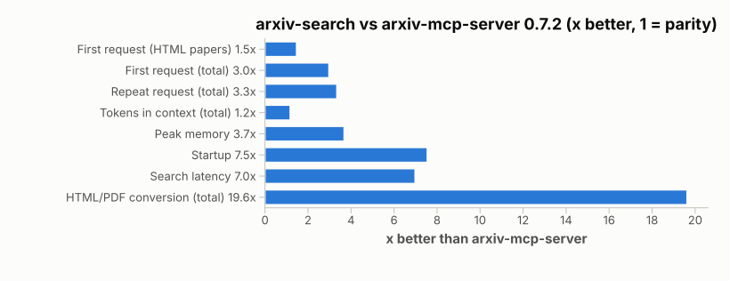
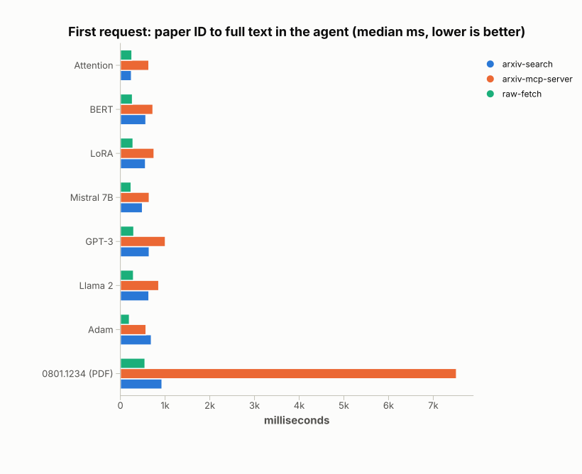
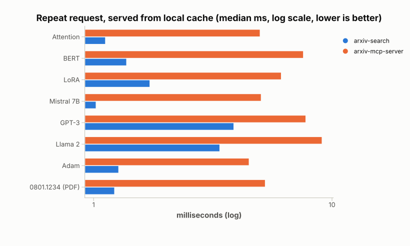
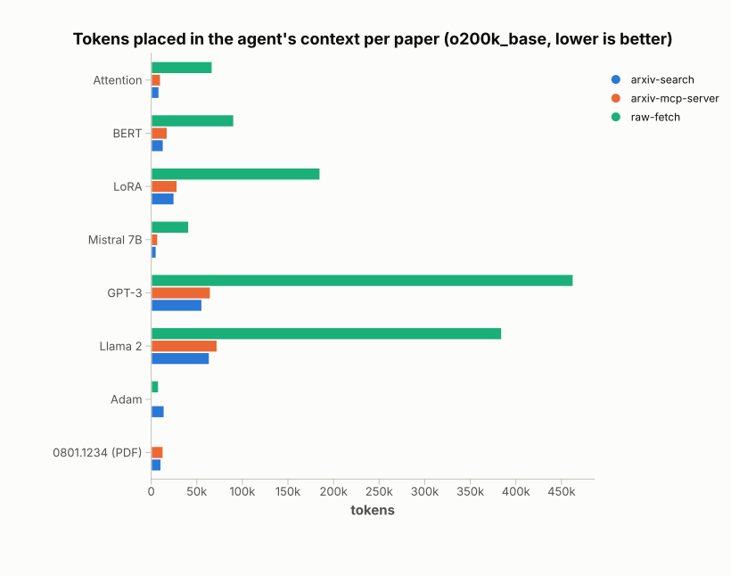
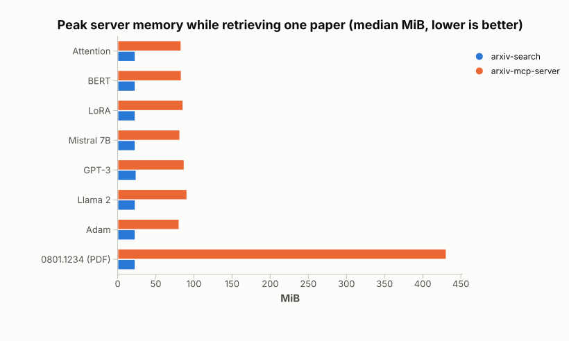
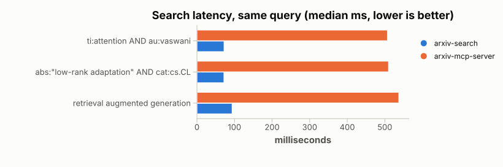
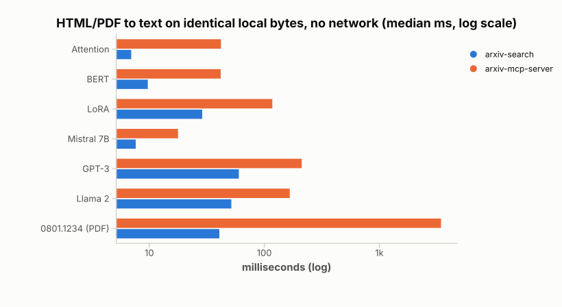

# Benchmarks

`arxiv-search` compared with [`arxiv-mcp-server`](https://github.com/blazickjp/arxiv-mcp-server) 0.7.2, the most widely used arXiv MCP server, on the same 8 papers and 3 queries. Measurements are end to end over MCP stdio, from the moment a tool call is sent until the paper text is in the agent's context.

<picture>
  <source media="(prefers-color-scheme: dark)" srcset="arxiv/charts/summary-dark.svg">
  
</picture>

| | arxiv-search | arxiv-mcp-server 0.7.2 | |
|---|---:|---:|---:|
| First request, 7 papers (total) | **4.1 s** | 12.2 s | 3.0× faster |
| First request, 6 HTML papers (total) | **3.2 s** | 4.6 s | 1.5× faster |
| Repeat request, 7 papers (total) | **14 ms** | 46 ms | 3.3× faster |
| Tokens in context, 7 papers (total) | **183,625** | 214,798 | 15% fewer |
| Peak server memory | **23–25 MiB** | 81–432 MiB | 3.5–19× less |
| Startup to ready (median) | **88 ms** | 664 ms | 7.5× faster |
| Search latency (median) | **73 ms** | 510 ms | 7.0× faster |
| Search tokens, 3 queries, full abstracts | **14,343** | 16,463 | 13% fewer |
| HTML/PDF conversion, no network (total) | **208 ms** | 4,075 ms | 19.6× faster |

The totals cover the 7 papers where both tools return the paper. For the 8th, Adam (`1412.6980`), arXiv serves a broken HTML page. `arxiv-search` detects this and returns the full paper from the PDF; `arxiv-mcp-server` returns 135 tokens of empty page.

Setup: 4 vCPU Intel Xeon @ 2.80 GHz, 15.7 GiB RAM, Linux, run from a cloud container with outbound traffic through an HTTPS proxy. Measured on 2026-09-29 at commit `e2b6621`. The run was flagged dirty only because the chart renderer was being edited; the server and harness code match that commit. Raw data: [`arxiv/results/20260929T034545Z-linux-cloud-4vcpu.json`](arxiv/results/20260929T034545Z-linux-cloud-4vcpu.json), full tables: [`.md`](arxiv/results/20260929T034545Z-linux-cloud-4vcpu.md).

## First request: paper ID to full text

A fresh server process with an empty cache, so this includes arXiv network time. `raw-fetch` is a plain HTTP GET of the arXiv HTML page, the unprocessed page a generic web-fetch tool would hand the model.

<picture>
  <source media="(prefers-color-scheme: dark)" srcset="arxiv/charts/retrieve-cold-dark.svg">
  
</picture>

## Repeat request

The same paper requested again in the same process, served from each tool's local cache.

<picture>
  <source media="(prefers-color-scheme: dark)" srcset="arxiv/charts/retrieve-warm-dark.svg">
  
</picture>

## Tokens in the agent's context

Everything the tool returns, counted with `tiktoken` `o200k_base`. The raw HTML page runs 5–8× larger than either tool's output. A raw PDF isn't text, so it has no bar.

<picture>
  <source media="(prefers-color-scheme: dark)" srcset="arxiv/charts/tokens-dark.svg">
  
</picture>

Where the savings come from:
- **Math appears once**, as `$TeX$`, instead of both the MathML rendering and the TeX.
- **In-page citation and cross-reference links** are unwrapped to plain text.
- **The reference list is dropped.** Appendices are kept.

Without reference pruning, our output would be larger than the incumbent's on five of the six HTML papers, by 0.2–13% (see the `convert` table in the results file).

## Memory

Peak resident memory of the server process while retrieving one paper. The incumbent's PDF path (`pymupdf4llm` with layout analysis) peaks at 431 MiB.

<picture>
  <source media="(prefers-color-scheme: dark)" srcset="arxiv/charts/memory-dark.svg">
  
</picture>

## Search

The same Lucene query to both servers, each in a warm process. The incumbent is called with `abstract_mode: "full"` so both return full abstracts.

<picture>
  <source media="(prefers-color-scheme: dark)" srcset="arxiv/charts/search-dark.svg">
  
</picture>

## Conversion without network

Each tool's own HTML/PDF-to-text converter, run on byte-identical local files, 10 iterations each (median). Log scale.

<picture>
  <source media="(prefers-color-scheme: dark)" srcset="arxiv/charts/convert-dark.svg">
  
</picture>

## Per paper

Medians of 3 cold runs, with 5 repeat requests per run. **arxiv-search** vs arxiv-mcp-server.

| Paper | First request (ms) | Repeat request (ms) | Tokens in context | Peak memory (MiB) |
|---|---:|---:|---:|---:|
| Attention (`1706.03762v7`) | **248** vs 637 | **1.1** vs 5.0 | **8,728** vs 10,376 | **23** vs 83 |
| BERT (`1810.04805v2`) | **571** vs 729 | **1.4** vs 7.6 | **13,413** vs 17,745 | **23** vs 84 |
| LoRA (`2106.09685v2`) | **562** vs 753 | **1.7** vs 6.1 | **25,212** vs 28,582 | **23** vs 86 |
| Mistral 7B (`2310.06825v1`) | **494** vs 646 | **1.0** vs 5.0 | **5,635** vs 7,326 | **23** vs 82 |
| GPT-3 (`2005.14165v4`) | **646** vs 1,006 | **3.9** vs 7.8 | **55,799** vs 65,066 | **24** vs 87 |
| Llama 2 (`2307.09288v2`) | **638** vs 859 | **3.4** vs 9.1 | **63,930** vs 72,483 | **23** vs 91 |
| Adam (`1412.6980v9`) | 693 (full paper via PDF) vs 574 (empty page) | **1.3** vs 4.5 | 14,370 (full paper) vs 135 (empty page) | **23** vs 81 |
| `0801.1234v2` (no HTML, PDF only) | **931** vs 7,519 | **1.2** vs 5.3 | **10,908** vs 13,220 | **23** vs 431 |

## What is measured

- **Tools.**
  - `arxiv-search` `retrieve_paper` / `search` with their defaults.
  - `arxiv-mcp-server` `download_paper` with `return_full_text: true`. Its default truncates at 12,000 chars and expects pagination, so this makes both return the full paper in one call.
  - `raw-fetch`, a plain GET of the arXiv HTML page.
  - `--jina` adds the hosted Jina Reader service. It's excluded from the charts because its output varied between identical requests.
- **Cold.** A new server process with a throwaway cache directory, then one `tools/call`. Startup (process spawn to MCP `initialize`) is measured separately.
- **Warm.** Repeat calls in the same process.
- **Peak memory.** `getrusage` max RSS of the server process, read when it exits.
- **Tokens.** Everything the tool returns into context, counted with `tiktoken` `o200k_base`.
- **Abstract recall.** The fraction of the paper's abstract words found in the output. It catches tools that are fast because they returned nothing.
- **Pacing and order.** Network calls are spaced 3.5 s apart, following arXiv's ≥3 s guidance. This also keeps the incumbent's built-in 3 s rate limiter out of its timings. Tool order alternates each rep.
- **Pinning.** Paper versions are pinned in [`arxiv/corpus.json`](arxiv/corpus.json). The incumbent and all its dependencies are frozen in [`arxiv/incumbent.lock.txt`](arxiv/incumbent.lock.txt).

## Reproduce

Requires a Rust toolchain, [`uv`](https://docs.astral.sh/uv/), and network access to arxiv.org.

```bash
# Build, install the frozen incumbent, download fixtures (~3 min)
uv run benchmarks/arxiv/bench.py setup

# Run all scenarios (~12 min, mostly polite pauses between arXiv requests)
uv run benchmarks/arxiv/bench.py run --label my-machine

# Render the charts (Charton) from a results file
cargo run --release --manifest-path benchmarks/charts/Cargo.toml -- benchmarks/arxiv/results/<file>.json
```

Other options:
- **Offline conversion only:** `run --scenarios convert`
- **A subset of papers:** `--papers <ids>`
- **Repetition counts:** `--cold-reps` and `--warm-reps`
- **Re-render the tables:** `bench.py report <file>.json`
